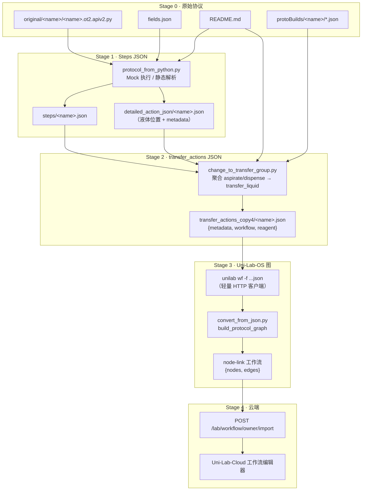

# Protocol 转换与 Uni-Lab-OS 工作流上传 — 使用说明

本文说明如何将 **Opentrons 协议**（`Protocols` 仓库）转换为 Uni-Lab-OS 可识别的工作流 JSON，并通过 **`unilab wf`**（`workflow_upload` 别名）上传到云端。

> 设计细节与字段约定见 monorepo 内 [`product_designs/protocol_convert/`](../../product_designs/protocol_convert/README.md)。

---

## 1. 功能流程图



**一句话概括**：Opentrons `.py` → mock 解析成 **steps** → 聚合成 **transfer_actions** → `unilab wf` 转成 **node-link 图** 并上传后端。

---

## 2. 目录层级与文件功能

### 2.1 `Protocols/` 仓库结构（与转换相关部分）

| 路径 | 类型 | 功能 |
|------|------|------|
| `protocols/` | 目录 | Opentrons 官方协议库源文件（`*.ot2.apiv2.py`），Makefile 解析入口 |
| `protoBuilds/<name>/` | 目录 | `protolib` 解析产物：labware 布局、deck slot、类型字符串等 |
| `protocol_converter/original/<name>/` | 目录 | **转换主输入**：每个协议一个文件夹 |
| `protocol_converter/original/<name>/<name>.ot2.apiv2.py` | 文件 | 协议 Python 源码（须含 `def run(ctx)`） |
| `protocol_converter/original/<name>/fields.json` | 文件 | 协议参数字段默认值（供 `get_values()` 读取） |
| `protocol_converter/original/<name>/README.md` | 文件 | 试剂说明、Categories 标签、Protocol Steps 等 |
| `protocol_converter/protocol_from_python.py` | 脚本 | **Stage 1**：Mock Opentrons API，捕获液体动作 → `steps/` |
| `protocol_converter/protocol_static_parser.py` | 模块 | Stage 1 静态 AST 解析（mock 失败时的 fallback） |
| `protocol_converter/run_steps_from_python.py` | 脚本 | Stage 1 独立入口（无 pylabrobot 依赖） |
| `protocol_converter/steps/<name>.json` | 文件 | **Stage 1 输出**：phase / action 序列（aspirate、dispense、mix…） |
| `protocol_converter/detailed_action_json/<name>.json` | 文件 | Stage 1 副产物：`liquid_locations`、`metadata` |
| `protocol_converter/change_to_transfer_group.py` | 脚本 | **Stage 2**：steps → `transfer_liquid` + `reagent` 块 |
| `protocol_converter/transfer_actions_copy4/<name>.json` | 文件 | **Stage 2 输出**（当前主版本目录名） |
| `protocol_converter/core_protocol/` | 目录 | 经分类筛选的「核心」协议 JSON 副本 |
| `protocol_converter/tests/` | 目录 | 转换器单元测试 |
| `protocol_converter/log/error_converting.txt` | 文件 | Stage 1 批量失败日志 |

### 2.2 `Uni-Lab-OS/` 相关部分

| 路径 | 类型 | 功能 |
|------|------|------|
| `labware_mapping.yaml` | 配置 | Opentrons labware → 目标仪器 `class_name`、slot 重映射规则 |
| `unilabos/workflow/convert_from_json.py` | 模块 | transfer_actions JSON → node-link `{nodes, edges}` |
| `unilabos/workflow/common.py` | 模块 | `build_protocol_graph`：生成 create_resource / set_liquid_from_plate / transfer_liquid 节点 |
| `unilabos/workflow/wf_utils.py` | 模块 | `upload_workflow`：读 JSON、自动转换格式、调用 HTTP 上传 |
| `unilabos/app/main.py` | CLI | 注册 `wf` / `workflow upload` 子命令 |
| `unilabos/app/cli/workflow.py` | 模块 | `cmd_workflow_upload`：鉴权 + 委托上传 |
| `unilabos/app/web/client.py` | 模块 | `workflow_import` → `POST /lab/workflow/owner/import` |

---

## 3. 环境准备

### 3.1 Python 依赖

在 monorepo 根目录或各自子项目中安装：

```bash
# Uni-Lab-OS（含 unilab CLI）
pip install -e ./Uni-Lab-OS

# Protocol 转换 Stage 1 仅需标准库 + 本目录脚本；
# Stage 2 读取 protoBuilds，需保证 Protocols/protoBuilds 已生成。
```

若 `original/` 下协议来自 Opentrons 官方库，需先构建 `protoBuilds`：

```bash
cd Protocols
make setup    # 首次：克隆 Opentrons 仓库并安装 protolib
make parse-ot2
```

### 3.2 云端凭据

上传前需配置 **ak/sk**（三选一）：

1. `unilab login --ak <AK> --sk <SK> [--addr test|uat|prod|https://...]`
2. 命令行 `--ak` / `--sk`
3. `local_config.py` 中设置 `BasicConfig.ak` / `BasicConfig.sk`

> `wf` / `workflow upload` 走**轻量 HTTP 客户端路径**，不会启动完整设备 / ROS 环境。

---

## 4. 协议转换（Protocols）

以下命令均在 `Protocols/protocol_converter/` 目录下执行。

### 4.1 单个协议

以协议 ID `00222e` 为例（对应 `original/00222e/` 文件夹）。

**Step 1 — 生成 steps JSON**

```bash
cd Protocols/protocol_converter

# 方式 A：直接调用主脚本
python protocol_from_python.py 00222e

# 方式 B：独立入口（推荐，依赖更少）
python run_steps_from_python.py 00222e
```

成功产物：

- `steps/00222e.json`
- `detailed_action_json/00222e.json`（可选，含液体位置与 metadata）

**Step 2 — 生成 transfer_actions JSON**

```bash
# 仅转换单个协议（Python 一行调用）
python -c "from change_to_transfer_group import export_transfer_actions; export_transfer_actions('00222e', 'transfer_actions_copy4/00222e.json')"
```

成功产物：`transfer_actions_copy4/00222e.json`，顶层结构示例：

```json
{
  "metadata": {
    "workflow_name": "协议显示名",
    "tags": ["标签1", "标签2"],
    "raw": {}
  },
  "workflow": [
    {
      "action": "transfer_liquid",
      "action_args": {
        "sources": "buffer",
        "targets": "samples",
        "asp_vols": [10.0],
        "dis_vols": [10.0],
        "tip_racks": "tiprack_6"
      }
    }
  ],
  "reagent": {
    "buffer": { "slot": 1, "well": ["A1"], "labware": "...", "object": "source", "liquid_name": "Buffer" }
  }
}
```

### 4.2 批量转换

**Step 1 — 批量生成 steps**

```bash
cd Protocols/protocol_converter
python protocol_from_python.py
# 或
python run_steps_from_python.py   # 无参数 = 批量
```

**Step 2 — 批量生成 transfer_actions**

```bash
# 默认输出到 transfer_actions_copy4/，并写 batch_summary.json
python change_to_transfer_group.py

# 等价写法：指定输出目录
python change_to_transfer_group.py batch transfer_actions_copy4

# 若不需要复制 core_protocol，加 --no-copy-core
python change_to_transfer_group.py --no-copy-core
```

批量结束后查看：

- `transfer_actions_copy4/batch_summary.json` — 成功 / 跳过 / 失败统计
- `invalid_transfer_protocols.txt` — 无有效 transfer 的协议列表

### 4.3 运行测试（可选）

```bash
cd Protocols/protocol_converter
pytest tests/ -q
```

---

## 5. 上传到 Uni-Lab-OS（`unilab wf`）

转换得到的 `transfer_actions_copy4/<name>.json` 可直接上传；CLI 会自动检测格式并调用 `convert_json_to_node_link` 转为 node-link 图。

### 5.1 基本用法

```bash
cd Uni-Lab-OS

# 首次登录（会话写入 unilabos_data/session.json）
unilab login --ak <YOUR_AK> --sk <YOUR_SK> --addr test

# 上传（wf 是 workflow_upload 的别名；-f 指定 JSON 文件）
unilab wf -f ../Protocols/protocol_converter/transfer_actions_copy4/00222e.json
```

等价命令：

```bash
unilab workflow upload -f ../Protocols/protocol_converter/transfer_actions_copy4/00222e.json
unilab workflow_upload -f ../Protocols/protocol_converter/transfer_actions_copy4/00222e.json
```

### 5.2 常用参数

| 参数 | 简写 | 默认值 | 说明 |
|------|------|--------|------|
| `--workflow_file` | `-f` | （必填） | transfer_actions 或 node-link JSON 路径 |
| `--workflow_name` | `-n` | 文件内 metadata.workflow_name → 文件名 | 覆盖工作流显示名 |
| `--tags` | — | metadata.tags → 空 | 空格分隔标签列表 |
| `--published` | — | `false` | 上传后是否发布 |
| `--description` | — | `""` | 发布时的描述 |
| `--target_device` | — | `prcxi` | 目标仪器厂商段（查 `labware_mapping.yaml`） |
| `--target_model` | — | `None` | 同厂商内型号（如 `9320`），影响 slot_remap |
| `--addr` | — | 会话 / 配置 | 后端地址：`test` / `uat` / `prod` / 完整 URL |
| `--ak` / `--sk` | — | 会话 | 临时覆盖凭据 |

**示例 — 指定 PRCXI 9320 并发布：**

```bash
unilab wf \
  -f ../Protocols/protocol_converter/transfer_actions_copy4/00222e.json \
  -n "00222e Agar Plating" \
  --tags PCR 液体处理 \
  --target_device prcxi \
  --target_model 9320 \
  --published \
  --description "从 Opentrons 协议转换"
```

**示例 — 面向其他目标仪器（映射表已配置时）：**

```bash
unilab wf -f workflow.json --target_device tecan
unilab wf -f workflow.json --target_device beckman
```

### 5.3 上传时内部发生了什么

1. 读取 JSON；若顶层含 `metadata`，保留 `workflow_name` / `tags` 供命名。
2. 若不是 node-link 格式（无 `nodes`/`edges`），按 `--target_device` / `--target_model` 调用 `convert_from_json`：
   - 查 `labware_mapping.yaml` 映射 Opentrons 板型 → 目标仪器 `create_resource.class_name`
   - 构建 `create_resource` → `set_liquid_from_plate` → `transfer_liquid` 节点图
3. `http_client.workflow_import` POST 到 `/lab/workflow/owner/import`
4. 请求体会备份到 `<working_dir>/req_workflow_upload.json`

上传成功后终端会打印工作流 **UUID** 与名称，可在 Uni-Lab-Cloud 工作流库中查看与编辑。

---

## 6. 端到端示例（复制即用）

假设 monorepo 根目录为 `LeapLab/`，协议 ID 为 `00222e`：

```bash
# ── 1. 转换 ──
cd LeapLab/Protocols/protocol_converter
python run_steps_from_python.py 00222e
python -c "from change_to_transfer_group import export_transfer_actions; export_transfer_actions('00222e', 'transfer_actions_copy4/00222e.json')"

# ── 2. 上传 ──
cd ../../Uni-Lab-OS
unilab login --ak <AK> --sk <SK> --addr test
unilab wf -f ../Protocols/protocol_converter/transfer_actions_copy4/00222e.json --target_device prcxi
```

---

## 7. 支持的输入 JSON 格式（上传阶段）

`upload_workflow` 自动识别以下格式并转换：

| 格式 | 特征字段 |
|------|----------|
| node-link（已转换） | `nodes` + `edges` |
| transfer_actions（推荐） | `workflow` + `reagent`（可选 `metadata`） |
| steps_info 形态 | `steps_info` + `labware_info` |
| steps 形态 | `steps` + `labware` |

日常流程使用 Stage 2 产出的 **`transfer_actions_copy4/*.json`** 即可。

---

## 8. 常见问题

| 现象 | 可能原因 | 处理 |
|------|----------|------|
| Stage 1 报 `original 目录不存在` | 未在 `protocol_converter/` 下运行 | `cd Protocols/protocol_converter` 后再执行 |
| Stage 1 单个协议 FAIL | 协议使用未 mock 的 API（module、复杂 transfer） | 查 `log/error_converting.txt`；尝试静态解析或简化协议 |
| Stage 2 跳过「没有有效 actions」 | steps 中无完整 aspirate+dispense 相位 | 检查 `steps/<name>.json` 是否为空 phase |
| 上传报「未找到 ak/sk」 | 未 login | `unilab login --ak ... --sk ...` |
| 上传后 labware 类型不对 | 映射表未覆盖该 Opentrons 板型 | 补 `Uni-Lab-OS/labware_mapping.yaml`，或换 `--target_device` |
| `workflow_name` 为空 | 协议 `.py` 无 `metadata['protocolName']` | 上传时用 `-n` 显式指定名称 |

---

## 9. 与旧版 README 的关系

根目录 [`Protocols/README.md`](../README.md) 描述的是**早期四阶段管线**（代码注入 → Opentrons 仿真 → 日志解析 → transfer 导出），依赖 `original copy/`、`detailed_info_extract.py`、`prcxi_protocol_converter.py`。

**当前推荐路径**（本文档）：

- 输入目录：`protocol_converter/original/`
- Stage 1：`protocol_from_python.py`（Mock，无需 Opentrons 仿真）
- Stage 2：`change_to_transfer_group.py` → `transfer_actions_copy4/`
- Stage 3：`unilab wf -f ...`

两套管线并存于仓库中；新协议请按本文档流程操作。

---

## 10. 参考链接

- 转换链路设计：[`product_designs/protocol_convert/README.md`](../../product_designs/protocol_convert/README.md)
- 数据流与 JSON 字段：[`product_designs/protocol_convert/00-data-flow-and-conventions.md`](../../product_designs/protocol_convert/00-data-flow-and-conventions.md)
- 物料映射与 `--target_device`：[`product_designs/protocol_convert/06-labware-mapping-table.md`](../../product_designs/protocol_convert/06-labware-mapping-table.md)
- Uni-Lab-OS CLI：`Uni-Lab-OS/unilabos/app/main.py`（`wf` / `workflow upload` 子命令）
